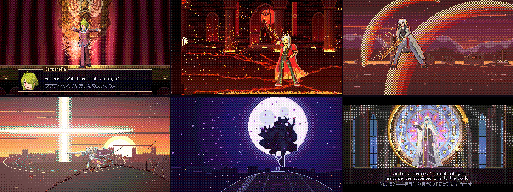

# Ouroboros PV

A 100-second pixel-art trailer for **Ouroboros (身喰らう蛇)** from *The Legend of Heroes: Trails* series. Everything is generated from Python code, with no drawing tools involved. That covers every sprite, scene and sound effect. The score is composed in code and played through a free SoundFont.



**▶ Watch:** download the Chinese or English version from [Releases](../../releases).

## What's in it

- The Fool Campanella hosts the whole thing as a stage play. Each of these Enforcers and Anguis gets one act based on the games' story:
  - McBurn
  - Leonhardt
  - Arianrhod
  - Bleublanc
  - Vita
- It builds up to the Grandmaster. Acts are joined by a flipping playing card.
- Lines are the original Japanese, with Chinese or English subtitles.
- The music starts mysterious in D minor at 90 BPM. It turns into a 144 BPM boss battle and ends the curtain call on a D major chord. Every hit in the video lands on a beat of the score.
- Portraits are checked against official art with numbers, not just by eye: `tools/measure.py` aligns landmarks and scores silhouette, edges and hair/skin regions.

## Build it yourself

You need Python 3 (tested on 3.14), `ffmpeg` and `fluidsynth`.

```bash
brew install ffmpeg fluid-synth      # Linux: apt install ffmpeg fluidsynth
bash build.sh
```

This takes about 4 minutes and writes `out/ouroboros_pv_zh.mp4` and `out/ouroboros_pv_en.mp4`.

Useful commands while tinkering:

```bash
cd src
python director.py --only mcburn ../out/mcburn.mp4   # render a single act
python director.py --sheet vita                      # contact sheet of one act
PV_LANG=en python director.py --preview 30 60        # stills at given seconds

cd ..
python tools/fetch_refs.py                           # download official reference art (local only)
python tools/measure.py report                       # portrait / body fidelity report
```

## Credits

- **Built with:** [Claude Code](https://claude.com/claude-code), using Claude Opus 5.5.
- **Fonts:** [Fusion Pixel Font](https://github.com/TakWolf/fusion-pixel-font).
- **SoundFont:** [GeneralUser GS](https://schristiancollins.com/generaluser.php).

## License

Code is released under the [MIT license](LICENSE). Bundled fonts and the SoundFont keep their own licenses; see [THIRD_PARTY_NOTICES.md](THIRD_PARTY_NOTICES.md).

This is a non-commercial fan work. The Trails series and its characters belong to Nihon Falcom. This project is not affiliated with Nihon Falcom.
